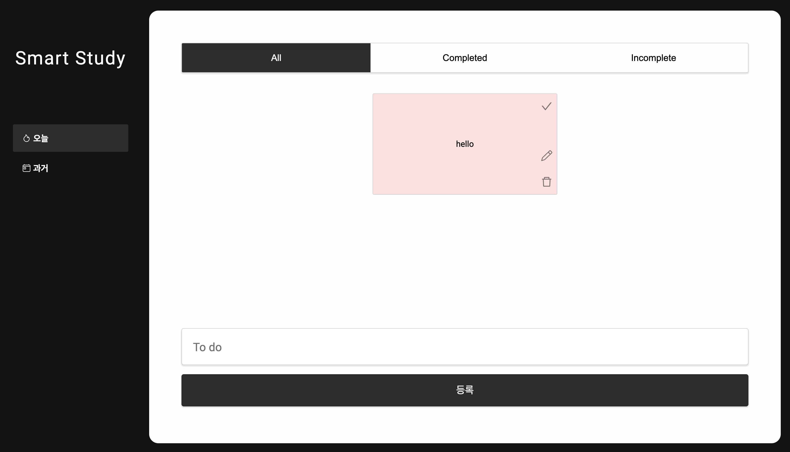

## Renewal Todo App

#### [웹 바로가기](https://renewal-todo.vercel.app/)
---

---

### 개요

로컬스토리지를 활용하여 개인 일정을 관리할 목적으로 제작하였으며

달력을 통해 지난 일정을 둘러볼 수 있습니다.

---
### 도구
`HTML, CSS, JS, Styled-Components, React-router-dom`
___
### 에러사항

- Create React App으로 만든 프로젝트에서 다운받아지는 webpack의 번들링 에러를 해결하였습니다. [참고 페이지](https://stackoverflow.com/questions/76435306/babel-preset-react-app-is-importing-the-babel-plugin-proposal-private-propert)

---

### API

React-Calendar - https://www.npmjs.com/package/react-calendar

---
